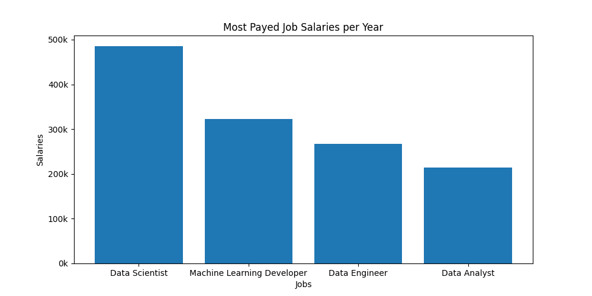

# Visualization with Flaws and Respective Corrections

1. Geographic Bias

Implication: People might misinterpret the visual dominance of red areas as indicating Republican majority support, when many of these large red counties have very small populations compared to the smaller blue urban areas. This creates a false impression of overwhelming Republican support.

2. Binary Color Coding

Implication: People will miss the nuanced reality of close elections. A county that voted 51% Republican appears identical to one that voted 80% Republican, hiding crucial information about swing areas, competitive races, and the actual margin of victory.

3. Population Density Distortion

Implication: People will underestimate Democratic support because high-population urban centers (which tend to vote Democratic) appear as tiny specks on the map, while low-population rural areas (which tend to vote Republican) dominate the visual space, creating a misleading sense of the actual vote distribution.

[Dataset 2016 Election](https://www.kaggle.com/datasets/benhamner/2016-us-election)

## Correction:

Using a pie chart to represent salary ranges is misleading because pie charts imply exact proportions, not variable data.

Circular Layout Obscures Comparison
Comparing salaries around a circle makes it difficult for viewers to accurately assess differences between roles.

No Clear Quantitative Axis
Without a numerical scale or reference, it’s unclear what the pie slices actually represent, leading to potential misinterpretation.

[Dataset Job Salaries](https://www.kaggle.com/datasets/saurabhshahane/data-science-jobs-salaries)

## Correction: 

